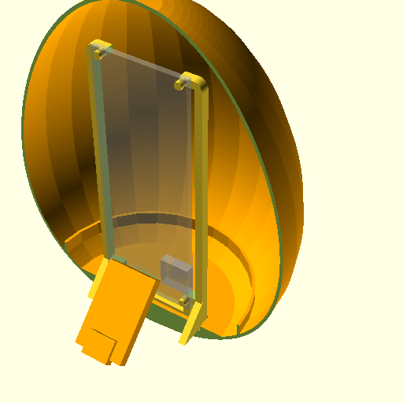
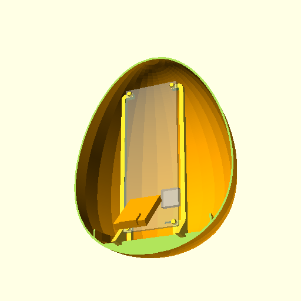

# egg

The tiny blurry community lamp.

### Build
todo: docker build

## Server

## Client

## Web


### Model
todo: image; with cut?






### Circuit
todo: images


### Notes

```shell
$ openscad -o e.stl -D 'egg_length=150' egg.scad 
$ openscad -o e.png egg.scad
```

### Build building docker
```shell
$ docker build . --tag nantipov/egg-build:latest
$ docker push nantipov/egg-build:latest
```
